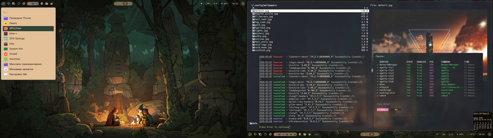
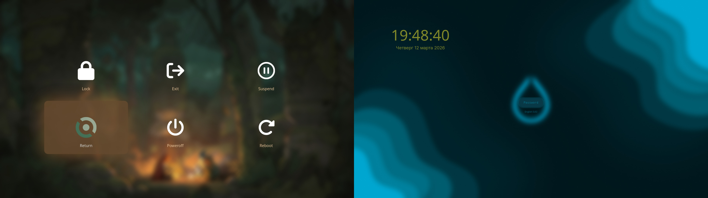
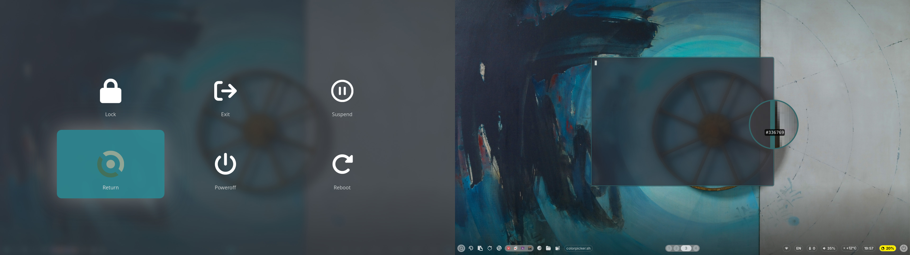

<details><summary>Click to preview</summary>



</details>

# My config files for Hyprland

A working configuration of Hyprland for Void Linux

## Installation

#### Install void-base system from latest live cd
```
void-installer 
```

#### After system restart Install git package and clone hypr-void dotfiles
```
sudo xbps-install -S git
git clone https://github.com/scorpp13/hypr-void.git $HOME/hypr-void/
```
Alternatively it may be cloned from those locations:
- https://gitlab.com/scorpp13/hypr-void.git
- https://codeberg.org/scorpp13/hypr-void.git
- https://git@git.sourcecraft.dev/scorpp13/hypr-void.git

#### Change to dotfiles folder and start installation script
```
cd $HOME/hypr-void/
./install.sh
```

###### For systems with sound card sof-essx8336 copy preconfig file
```
sudo cp alsa-base.conf /etc/modprobe.d/
```

#### Final steps

After first start of hyprland desktop:
- Run waypaper, choose wallpapers folder and change to wallpaper you preffer
- Reload Hyprland instance (press SUPER+R) to dismiss warnings (no wal colors in cache)

#### Enjoy
#### `^;^`
