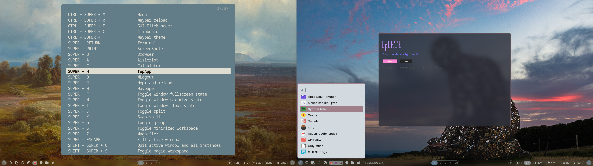
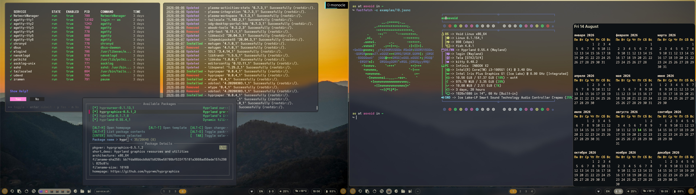

<details><summary>Click to preview</summary>



</details>

# My config files for Hyprland

A working configuration of Hyprland for Void Linux
- A new config based on lua script language.
- Old version based on hyprlang is also available.
- Dynamic desktop themes with pywal accent colors.

> [!NOTE]
> Hypr-Void environment is designed to use with a fresh Void Linux base system installation.<br>
> Also it may be used on existing system. The new installation script will make backup of your config files.<br>
> During installation the script will check your system before making any changes on it.<br>
> If something goes wrong, the script will terminate. Later you can check for errors in order to make changes.<br>
> You must remember, that there is no official support of Hyprland in Void Linux. The necessary binaries is used from 3-d party repository.<br>
> Some of them may be unnabled or making conflicts with system libraries. In such a case you may wish to delete them from necessary-packages.<br>
> I don't suggest to go this way. Otherwise the Hypr-Void environment will not work as designed.<br>
> Changable without affecting is user defined apps: browser, terminal, gui-filemanager, cli-filemanager, mediaplayer, volume-control.<br>

## Installation

#### Install void-base system from latest live cd
```
void-installer 
```

#### After system restart install git package and clone hypr-void dotfiles
```
sudo xbps-install -S git
git clone https://github.com/scorpp13/hypr-void.git $HOME/hypr-void/
```
<details>
<summary>Click to view other mirrors</summary>
→ https://gitlab.com/scorpp13/hypr-void.git
<br>
→ https://codeberg.org/scorpp13/hypr-void.git
<br>
→ https://git.sourcecraft.dev/scorpp13/hypr-void.git
<br>
→ https://gitea.com/scorpp13/hypr-void.git
</details>

#### Change to dotfiles folder and start installation script
```
cd $HOME/hypr-void/
./install.sh
```
For systems with sound card sof-essx8336 copy preconfig file:
- `sudo cp alsa-base.conf /etc/modprobe.d/`

> [!CAUTION]
> Gum v2 have a lot of bags, so my scripts don't work correctly with it.<br>
> To make all work download binary v1.7 from [official GitHub page](https://github.com/charmbracelet/gum/releases/download/v0.17.0/gum_0.17.0_Linux_x86_64.tar.gz).<br>
> Unpack archive and change binary v2 vs binary v1.7 (/usr/bin/gum).

#### Final steps

After first start of hyprland desktop:
- Run waypaper, choose wallpapers folder and change to wallpaper you preffer.
- Reload Hyprland instance (press SUPER+R) to dismiss warnings (no wal colors in cache).
- Install your preffered apps and then run userapps.sh to integrate them into config.
Default apps: browser=vivaldi-stable, terminal=kitty, gui-filemanager=thunar, cli-filemanager=vifm, mediaplayer=mpv, volume-control=pwvucontrol.

#### Enjoy
#### `^;^`
